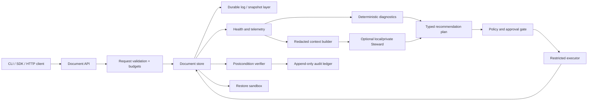

# VDB Architecture

## Scope

The MVP is a local-first document database. It exposes collections and documents while keeping the storage implementation behind a stable repository interface. The first implementation uses a mature embedded storage foundation rather than attempting to create a new database kernel and distributed protocol simultaneously.

## Logical components

## Trust zones

| Zone | Responsibility | Boundary |
|---|---|---|
| Data plane | Documents, versions, indexes, log, snapshots | Never bypassed by the AI |
| Request plane | Authentication, validation, query budgets, pagination | Rejects malformed or oversized requests |
| Intelligence plane | Health summaries, rules, redaction, optional model | Model output is untrusted |
| Action plane | Typed plans, approvals, executor, verifier | No generic shell or arbitrary command tool |
| Recovery plane | Backup manifests, restore sandbox, checksums | Recovery tests do not modify production by default |

## Storage boundary

The public model is a document store. Each document has an immutable `_id`, a monotonically increasing version, created/updated timestamps, and a payload. The implementation should keep storage replaceable through a repository interface so that a mature embedded engine can be used during the MVP and a specialized engine can be evaluated later.

Internal records should be encoded in a compact typed format such as CBOR. Public clients may use JSON for convenience. Trusted control messages and action plans should use a schema-validated format such as Protocol Buffers or an equivalent typed representation.

## Consistency and concurrency

The MVP uses optimistic document versions. A conditional update succeeds only when the caller's expected version matches the stored version. Conflicts return a structured error containing the current version and a safe retry path. Queries are bounded by result count, document size, and execution budget.

The MVP should make its concurrency boundary explicit. It may begin with a single local writer and concurrent readers, or with a mature embedded engine's supported concurrency model. Multi-process shared writes and distributed replication are separate milestones.

## Steward behavior

The Steward is initially read-only. It receives health metrics, query fingerprints, schema summaries, storage statistics, backup status, and approved redacted samples. It produces findings and typed recommendations. A recommendation contains evidence, confidence, affected scope, estimated cost, risk, preconditions, approval requirement, and rollback or recovery procedure.

Deterministic rules own detection of known conditions. The model is optional and is used for explanation, classification, and natural-language help. It never receives database root credentials and never executes a generic command.

## Recovery flow

1. Detect a failure or unusual condition.
2. Preserve evidence and identify affected scope.
3. Create or verify a snapshot before any write-affecting repair.
4. Restore into an isolated sandbox when possible.
5. Simulate or canary the proposed change.
6. Require approval according to policy.
7. Execute through a typed operation.
8. Verify postconditions and health metrics.
9. Commit the change or roll back using the recorded recovery path.

## Non-goals for MVP

VDB does not initially provide multi-region active-active replication, automatic conflict-free migration, full MongoDB compatibility, unrestricted natural-language writes, remote inference by default, or autonomous destructive repairs.
